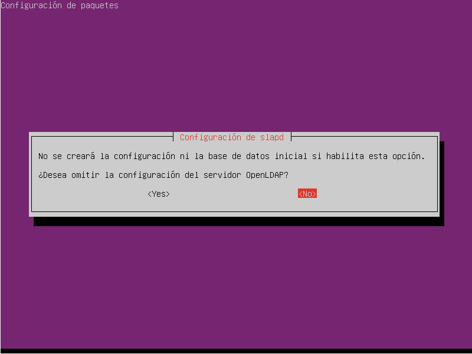
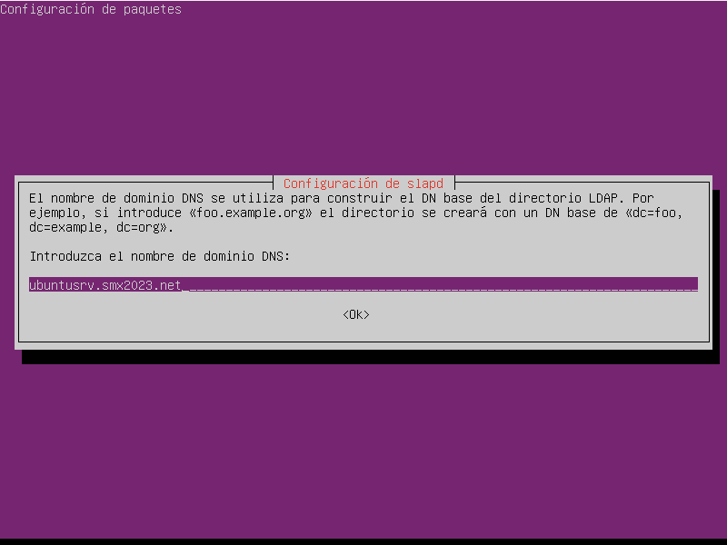
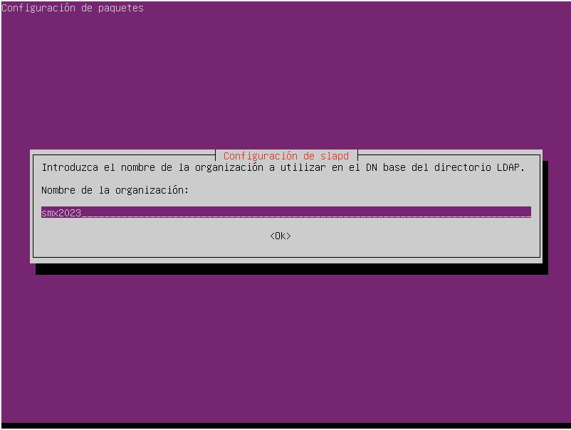
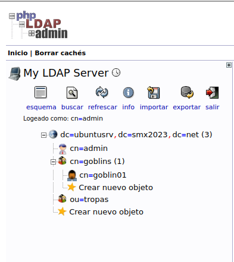

# GUIA LDAP
 
## Intalación [OpenLDAP - MySQL - phpLDAPadmin ]

1. Comenzamos instalando el paquete [ slpad ] <pre>**sudo apt install slapd** --> [ donde contiene el servidor de **LDAP** ]  

2. Seguidamente instalaremos el servicio MySQL con <pre> **sudo apt install mysql-server**   

3.Después de instalar [ MySQL ] procedemos a instalar el paquete phpldadmin <pre> **sudo apt install phpldadmin** 

~~~
http://HERE-MY-IP/phpldapadmin/
~~~

5. Gracias a Ángel nos aporto la solución para solucionar el problema, y fue actualizar a la última versión. <pre> **wget https://github.com/leenooks/phpLDAPadmin/archive/refs/tags/1.2.6.4.zip**

6. Cuando descargamos el zip [ 1.2.6.4.zip ] lo movemos a la ruta: /usr/share/phpldamin . Ahora hacemos una copia de de todo los ficheros y directorios y lo pegamos en otro directorio. Despues de hacer la copia de seguridad, descomprimimos el archivo y movemos todos los ficheros y directorios a la ruta:  <code>//usr/share/phpldamin/</code>  

## Configurando SLAPD

1. Ejecutamos este comando ! --> <code>sudo dpkg-reconfigure slapd</code>

### 1.1

### 1.2

### 1.3

### 1.4
* Añadimos la contraseña que quedaria tal que <code>dc=ubuntusrvXX,dc=smx2023,dc=net</code>

## Configurando phpLDAPadmin

1. Para acceder al servidor debemos introducir los siguientes datos: "cn=admin,dc=ubuntusrvXX,dc=smx2023,dc=net" la contraseña será la que hemos introducido "smx2023"

2. Y entramos para poder crear nuestros objetos

## CREANDO OBJETOS EN LDAP

* Tenemos que hacer esta estructura: 
~~~
dc=ubuntusrvXX,dc=smx2023,dc=net
    cn=admin
    cn=goblins
       cn=goblin01
ou=tropas
~~~

* Resultado: 

## INSTALACION DE LDAP-UTILS

<code>sudo apt install ldap-utils</code> Instalamos las utilidades de LDAP

* Ahora para conectar con el <code>ldap server</code> ponemos en nuestra terminal <code>ldapsearch -x -h dc=ubuntusrv,dc=smx2023,dc=net -H ldap://YOUR-IP</code>
