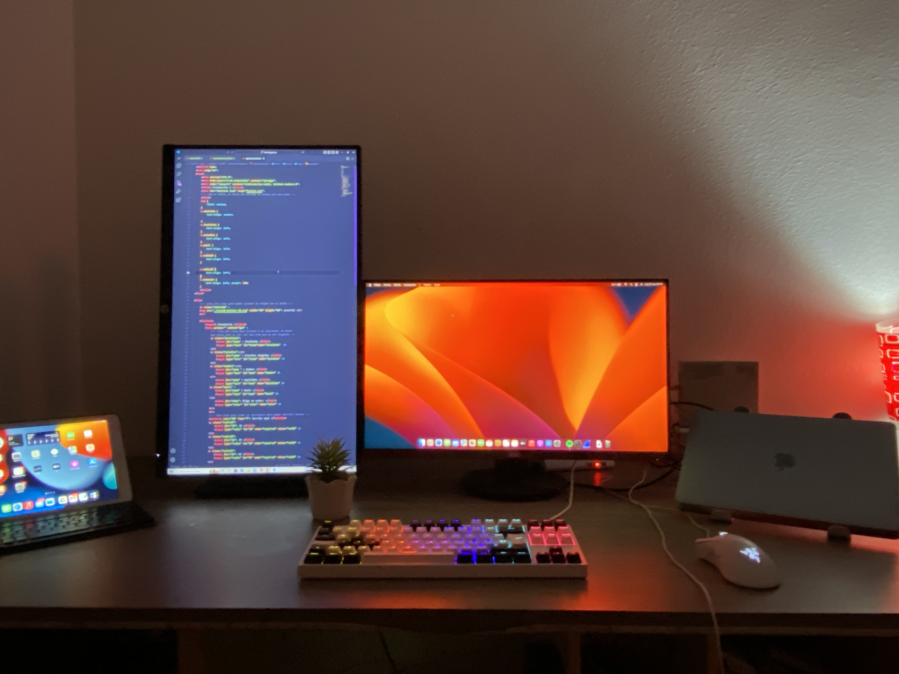

<img2 src="https://raw.githubusercontent.com/Tarikul-Islam-Anik/Animated-Fluent-Emojis/master/Emojis/People%20with%20professions/Man%20Technologist%20Light%20Skin%20Tone.png" alt="Man Technologist Light Skin Tone" width="150" height="150" />
<h1 align="center">Hi 👋, I'm Álvaro Escartí </h1>
<h3 align="center">A passionate frontend developer from Spain.</h3>

 

  

## Sistemas operativos que utilizo :

<code></code>
<code></code>
<code></code>

### Tecnologías que estoy aprendiendo : 
<code></code>
	<code></code>
	<code></code>
	<code></code>
	<code></code>
	<code></code>
	<code></code>
	<code></code>

### Favorite IDE'S:
<code></code>
	<code></code>

<h3 align="center">Lenguajes</h3>

  

## My work's space 

<!--
**escartii/escartii** is a ✨ _special_ ✨ repository because its `README.md` (this file) appears on your GitHub profile.

Here are some ideas to get you started:

- 🔭 I’m currently working on ...
- 🌱 I’m currently learning ...
- 👯 I’m looking to collaborate on ...
- 🤔 I’m looking for help with ...
- 💬 Ask me about ...
- 📫 How to reach me: ...
- 😄 Pronouns: ...
- ⚡ Fun fact: ...
-->
