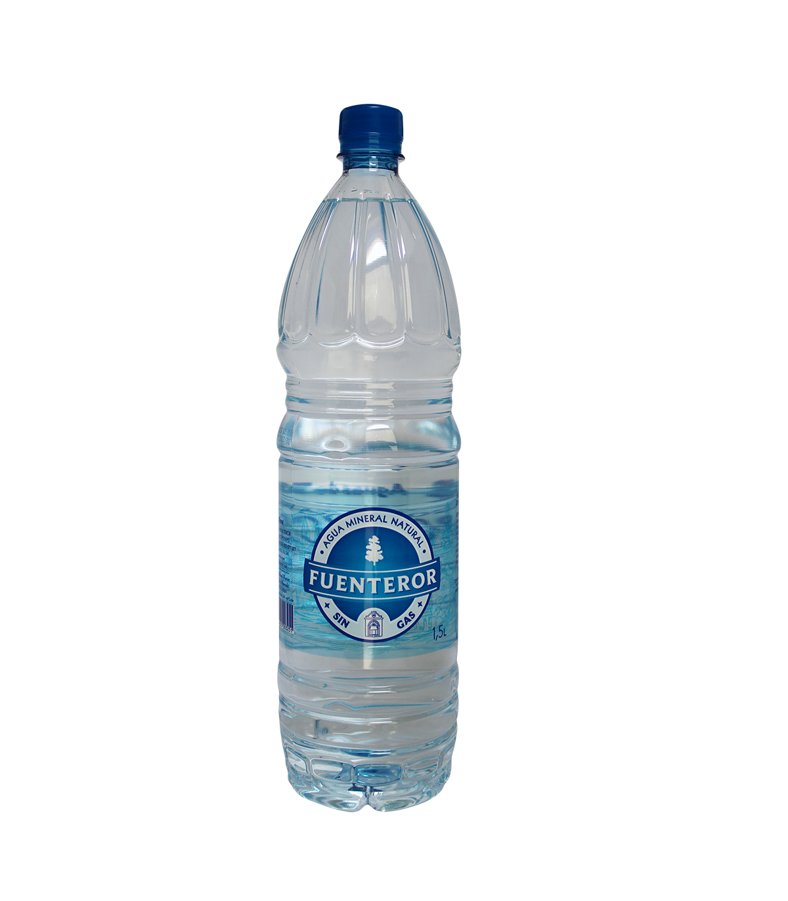

- Álvaro Esᴄᴀʀᴛɪ 
- 23 años :)

- 400 RPM :))

## Pc Specs:

## Sistemas Operativos :

### Lenguajes que estoy aprendiendo: 

## Mi lugar de trabajo 

## Idiomas que sé y que estoy aprendiendo

  

## Bebidas favoritas

 

<!--
**escartii/escartii** is a ✨ _special_ ✨ repository because its `README.md` (this file) appears on your GitHub profile.

Here are some ideas to get you started:

- 🔭 I’m currently working on ...
- 🌱 I’m currently learning ...
- 👯 I’m looking to collaborate on ...
- 🤔 I’m looking for help with ...
- 💬 Ask me about ...
- 📫 How to reach me: ...
- 😄 Pronouns: ...
- ⚡ Fun fact: ...
-->
